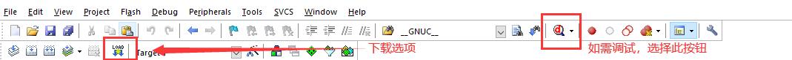

# 瑞萨 CPK-RA6M4 开发板 LVGL Demo 说明

## 简介

本设计是在 CPK-RA6M4 开发板上运行的 LVGL 音乐播放器 Demo。基于 RT-Thread 操作系统，支持 MDK5 软件开发环境。CPK-RA6M4  中控芯片为 RA6M4。本参考设计默认运行的是 LVGL 音乐播放器，拥有绚丽的音乐播放界面，并且，通过主界面的播放/暂停、上一首/下一首按钮控件，可以对音乐播放器进行播放控制。

## 开发板介绍

基于瑞萨 RA6M4 MCU 开发的 CPK-RA6M4 MCU 评估板，通过灵活配置软件包和 IDE，可帮助用户对 RA6M4 MCU 群组的特性轻松进行评估，并对嵌入系统应用程序进行开发。

开发板正面外观如下图：

 

该开发板常用 **板载资源** 如下：

- MCU：R7FA6M4AF3CFB，200MHz，Arm Cortex®-M33 内核，1MB 代码闪存, 256kB SRAM
- 调试接口：板载 J-Link 接口
- 扩展接口：两个 PMOD 连接器

## 技术架构

开发框架包括系统层、框架层、应用层三个主要层级：

### 系统层 System Layer

RT-Thread 是开源国产物联网操作系统，它是一个嵌入式实时多线程操作系统。它集成了大量的系统级基础组件，丰富的软件包，以及详尽的开发指导文档，具体包括：

- 内核层：RT-Thread 内核，是 RT-Thread 的核心部分，包括了内核系统中对象的实现，例如多线程及其调度、信号量、邮箱、消息队列、内存管理、定时器等；libcpu/BSP（芯片移植相关文件 / 板级支持包）与硬件密切相关，由外设驱动和 CPU 移植构成。
- 组件与服务层：组件是基于 RT-Thread 内核之上的上层软件，例如虚拟文件系统、FinSH 命令行界面、网络框架、设备框架等。采用模块化设计，做到组件内部高内聚，组件之间低耦合。
- RT-Thread 软件包：运行于 RT-Thread 物联网操作系统平台上，面向不同应用领域的通用软件组件，由描述信息、源代码或库文件组成。

### 组件层 Component Layer

除了系统层支持外，HMI-Board 还集成了多个出色的系统组件，其中 LVGL 作为多媒体组件加入到了本示例项目中。开发者只需要在 RT-Thread Studio/env 中使能 LVGL 软件包，并将其从服务器上拉取下来，便可以将 LVGL 以组件的形式加入到开发项目中。极大的简化了开发者手动将其加入项目中的步骤，提升效率。

### 应用层 Application Layer

应用层为用户在 LVGL 上进行 UI 的二次开发所使用的，用户可以已有/开发的 UI 代码写在 APP 层级。

音乐播放器 DEMO：

通过播放/暂停、上一首/下一首按钮控件，在触摸面板上可以对音乐播放器进行控制。通过上拉面板控件可以查看音乐列表。也可也在代码中修改手动播放为自动播放。

## 使用说明

本 BSP 目前仅提供 MDK5 工程。

**硬件连接**

* 使用 USB 数据线连接开发板到 PC，使用 J-link 接口下载和 DEBUG 程序。使用 USB 转串口工具连接 UART7：P613(TXD)、P614(RXD)。
* 使用 Arduino 拓展板，插入 ILI9341-SPI 屏幕。
* 或使用杜邦线进行连接：
  
> DC_PIN —— BSP_IO_PORT_04_PIN_15

> RES_PIN —— BSP_IO_PORT_06_PIN_11

> CS_PIN —— BSP_IO_PORT_04_PIN_13

> SPI_MISO_PIN —— BSP_IO_PORT_04_PIN_10

> SPI_MOSI_PIN —— BSP_IO_PORT_04_PIN_11

> SPI_PCLK_PIN —— BSP_IO_PORT_04_PIN_12

**MDK 编译，调试烧录**

- 编译：双击 project.uvprojx 文件，打开 MDK5 工程，编译程序。

* 调试+下载：点击调试按钮进行代码调试，这一步同时会烧录代码到mcu中。

**使用其他方式烧录固件**

- 注意：此工程需要使用 J-Flash Lite 工具烧录程序。建议使用 V7.50 及以上版本烧录工程。[J-Link 下载链接](https://www.segger.com/downloads/jlink/)

- 下载：打开 J-Flash lite 工具，选择芯片型号 R7FA6M4AF，点击 OK 进入工具。选择 BSP 目录下 MDK 编译出的 /object/ra6m4.hex 文件，点击 Program Device 按钮开始烧录。具体操作过程可参考下图步骤：

 

 

 

 

## 资料及文档

用户如果希望自行移植 LVGL，可以在 RT-Thread 文档中心查看移植相关文档和视频教程：

- [LVGL的对接与移植](https://www.rt-thread.org/document/site/#/rt-thread-version/rt-thread-standard/packages-manual/lvgl-docs/introduction)

如要进行 LVGL UI 开发可以前往 LVGL 官网以及文档中心获取详细资料：

- [LVGL - Light and Versatile Embedded Graphics Library](https://lvgl.io/)

- [LVGL documentation](https://docs.lvgl.io/8.3/)
